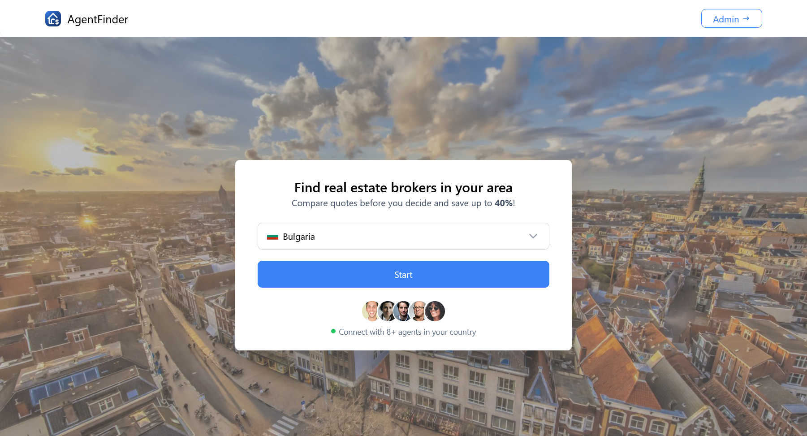
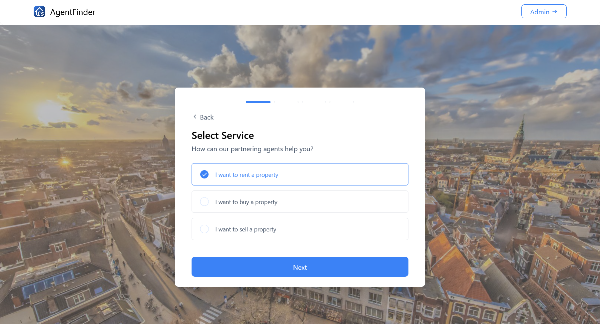
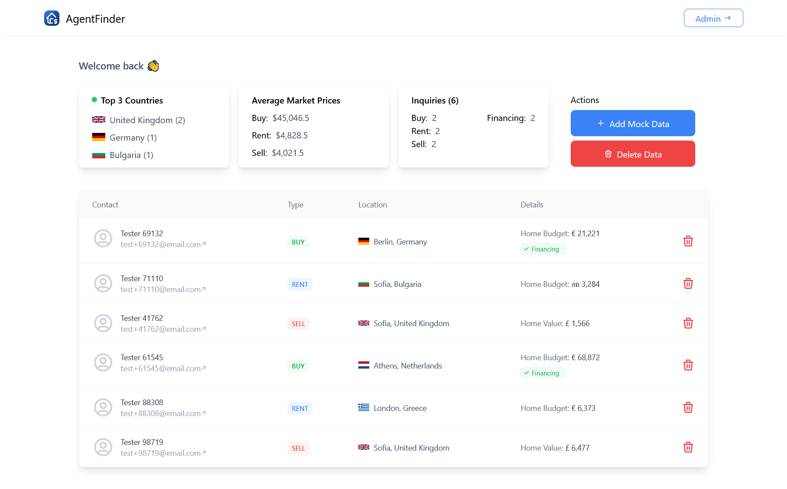

# Documentation
Welcome to the documentation for AgentFinder - the quickest way to get in touch with real estate agents in your area.

## Quick Start
In order to start the project you should run the following commands in the base project folder:

```bash
# Install all dependencies
npm install

# Start server
npm run dev
```
You should be able to access the project on [http://localhost:8080](http://localhost:8080)

## Dependencies
- [Vue 3](https://vuejs.org/)
- [Vue Router](https://router.vuejs.org/)
- [Vuelidate](https://vuelidate-next.netlify.app/)
- [Pinia](https://pinia.vuejs.org/) + [Pinia Persisted State](https://prazdevs.github.io/pinia-plugin-persistedstate/)
- [Tailwind CSS](https://tailwindcss.com)
- [HeadlessUI](https://headlessui.com/)
- [Tabler Icons](https://tabler-icons.io/)
- [Vue3 Click Away](https://github.com/VinceG/vue-click-away)

## Project Structure
The project is divided in the following structure:
```text
├─ src
│  ├─ assets        // Assets such as images and CSS
│  ├─ components    // Universal Vue components.
│  ├─ composables   // Reusable composable functions
│  ├─ models        // Data models - classes and interfaces
│  ├─ repositories  // Repositories that execute API calls
│  ├─ router        // Router configuration
│  ├─ stores        // Pinia stores.
│  └─ views         // Pages
```

## Components
The components folder is hosts reusable components that are used throughout the project
- `/` - hosts specific components like Header, Footer etc. that can be reused
- `/kit` - hosts generic components like input fields, comboboxes, checkboxes, etc. 
```text
├─ components
│  ├─ kit
│  │  ├─ Checkbox.vue            // Custom checkbox component that can be toggled
│  │  ├─ ComboBox.vue            // Custom select + autocomplete field
│  │  ├─ InputField.vue          // Custom input field wrapper
│  │  ├─ PrimaryButton.vue       // Custom button
│  │  └─ VerticalRadioGroup.vue  // Vertical radio group component styled for project needs
│  │
│  ├─ Header.vue                 // Header component
│  └─ CountriesComboBox.vue      // Custom combobox component that handles the selection of countries
```

## Views
The project is divided into 3 main views - "Home", "Create Inquiry" and "Admin" 
```text
├─ views
│  ├─ admin
│  │  ├─ AdminView.vue           // Admin dashboard
│  │  └─ ..
│  │
│  ├─ create-inquiry
│  │  ├─ CreateInquiryView.vue   // Hosts the create new inquiry flow (Buy/Sell/Rent)
│  │  └─ ..
│  │
│  ├─ HomeView.vue               // Entry point for new customers
```

#### Home
The entry point of the application from where the user can access other pages and initiate the inquiry creation flow.


#### Create Inquiry
A view that hosts a multi-step form aiming to build an inquiry.

In order to allow each step to be a separate sub-route it hosts a nested `router view` which allows each step to be added or replaced.
. 

#####  Step Manager
In order to keep the steps "dumb" and reusable an overarching composable has been created - `useCreateInquiryStepManager`. 

It aims to take control over the navigation and tracking of the progress during the inquiry creation flow. This way, new steps can be easily added into the flow and existing steps can be re-arranged and reused depending on the flow's needs.

In the code example below is shown how the different inquiry flow (Buy / Sell / Rent) can utilize a different set and order of steps. 

```
  const routeFlows: Map<string, string[]> = new Map([
    [
      InquiryType.RENT,
      ["/new/type", "/new/home-budget", "/new/contact", "/new/success"],
    ],
    [
      InquiryType.BUY,
      ["/new/type", "/new/home-budget", "/new/contact", "/new/financing", "/new/success"],
    ],
    [
      InquiryType.SELL,
      ["/new/type", "/new/home-value", "/new/contact", "/new/success"],
    ],
  ]);
```

#####  Inquiry Building
In order to build the final inquiry object the [Builder pattern](https://refactoring.guru/design-patterns/builder/typescript/example) has been utilized with the `InquiryBuilder` class. This way each step of the process adds to the final inquiry creation and keeps the building process flexible and future-proof.

#### Admin
The admin page of AgentFinder allows you to:
- Monitor form submission 
- See the top 3 most popular countries (based on the number rof inquiries for each)
- The average price / budget for each perspective aspect - Buy / Sell / Rent
- See the number of submitted inquiries and their division
- See how many people during the "Buy" inquiry flow have requested extra financing information
- Add mock data (each time 1 entry of different inquiry type is added - the data is random and sometimes far from a real situation, thus - mock data)
- Delete all submitted inquiries (both mock and and real) - use with caution
- Delete individual inquiries


## Styling
All components and views are created from scratch, styled using **Tailwind CSS**, and based on the native elements (except **VerticalRadioGroup** which is taken from **HeadlessUI**) 

## Storage
To persist data required for the application to run the project uses:
- `Pinia` - the new "go-to" state management library introduced by the Vue.js
- `Local Storage (with the Pinia Data Persistence Plugin)` - allows the Pinia stores to be serialized and persisted. This way, the available state data can be accessed after a refresh or browser tab close event.

Currently the storage is divided in 3 store:
- `inquiries` - stores the submitted inquiries and exposes various functionalities for data manipulation (add, delete, etc.)
- `countries` - stores the available countries data fetched via [REST Countries' API](https://restcountries.com) and exposes a communication interface with the data
- `newInquiry` - stores the progress during the "create new inquiry" flow.


#### Data Fetching
In order to fetch the countries data the project uses the native [Fetch API](https://developer.mozilla.org/en-US/docs/Web/API/Fetch_API)